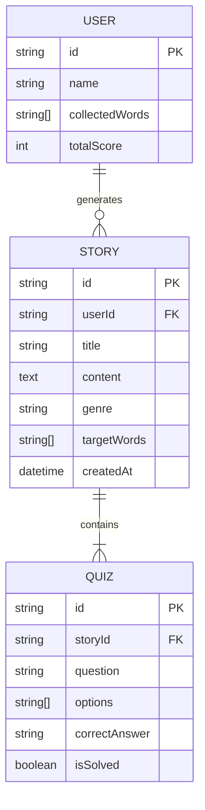

# Database Specification
**Project:** Word Master: My Own Novel Dungeon
**Version:** 1.0
**Date:** 2025-11-20

---

## 1. Overview
This document defines the data schema for the "Word Master" application.
*   **Prototype Storage**: Browser `localStorage` (JSON format).
*   **Future Storage**: Relational Database (PostgreSQL/MySQL) or NoSQL (MongoDB).

---

## 2. Entity Relationship Diagram (ERD)
*Conceptual Model*



---

## 3. Schema Definitions

### 3.1 Users Table (Local Key: `wm_user`)
Stores user profile and global progress.

| Field | Type | Description | Example |
| :--- | :--- | :--- | :--- |
| `id` | UUID | Unique User ID | `u_12345` |
| `name` | String | Hero Name | `Cheolsu` |
| `collectedWords` | JSON Array | List of learned words | `["Abstraction", "Variable"]` |
| `totalScore` | Integer | Total XP/Score accumulated | `1500` |

### 3.2 Stories Table (Local Key: `wm_stories`)
Stores generated stories history.

| Field | Type | Description | Example |
| :--- | :--- | :--- | :--- |
| `id` | UUID | Unique Story ID | `s_98765` |
| `userId` | UUID | Foreign Key to User | `u_12345` |
| `title` | String | Story Title | `The Sword of Code` |
| `content` | Text | Full story text | `Long ago...` |
| `genre` | String | Selected Genre | `Fantasy` |
| `targetWords` | JSON Array | Words used in this story | `["Variable", "Loop"]` |
| `createdAt` | ISO Date | Generation timestamp | `2025-11-20T10:00:00Z` |

### 3.3 Quizzes Table (Embedded in Story or Separate)
Stores quiz data associated with a story.

| Field | Type | Description | Example |
| :--- | :--- | :--- | :--- |
| `id` | UUID | Unique Quiz ID | `q_54321` |
| `storyId` | UUID | Foreign Key to Story | `s_98765` |
| `question` | String | The quiz question | `What is a variable?` |
| `options` | JSON Array | Multiple choice options | `["A box", "A cat", "A loop"]` |
| `correctAnswer` | String | The correct option | `A box` |
| `isSolved` | Boolean | Whether the user cleared it | `true` |

---

## 4. LocalStorage Implementation Strategy
For the prototype, we will simulate these tables using keys in `localStorage`.

*   `wm_user`: Stores the single active user object.
*   `wm_history`: Stores an array of Story objects (which include their Quiz data).

```javascript
// Example LocalStorage Data
{
  "wm_user": {
    "name": "Cheolsu",
    "collectedWords": ["Variable"],
    "totalScore": 100
  },
  "wm_history": [
    {
      "id": "s_1",
      "title": "Adventure 1",
      "content": "...",
      "quiz": { ... },
      "timestamp": 1732060000000
    }
  ]
}
```
