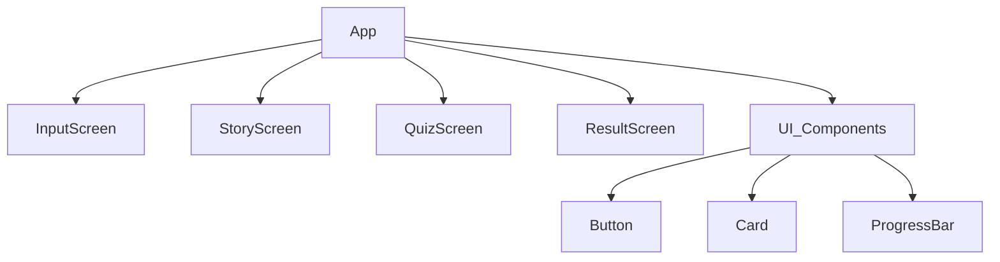

# Word Master: Development Methodology (RDD, SDD, TDD)

This document outlines the development approach for "Word Master: My Own Novel Dungeon", incorporating **RDD (Readme Driven Development)**, **SDD (Software Design Description)**, and **TDD (Test Driven Development)**.

---

## 1. RDD (Readme Driven Development)
*Philosophy: Write the Readme first to clearly define the product vision, features, and user interface before writing a single line of code.*

### Draft README.md
> **Word Master: My Own Novel Dungeon**
>
> A gamified vocabulary learning app for 5th graders where you become the hero of your own story.
>
> **Features**
> - **Personalized Story**: Enter your name, 3 words to learn, and pick a genre (Fantasy, SF, Horror).
> - **Immersive Reading**: Read a generated story where your words are the key items/skills.
> - **Boss Battle Quiz**: Defeat the boss by answering a context-based quiz question.
> - **Rewards**: Collect words and earn grades.
>
> **How to Run**
> ```bash
> npm install
> npm run dev
> ```
>
> **Tech Stack**
> - React, Vite, Tailwind CSS, OpenAI API

---

## 2. SDD (Software Design Description)
*Philosophy: Plan the architecture and data flow to minimize structural changes during implementation.*

### 2.1 System Architecture
- **Client**: React Single Page Application (SPA).
- **Server/API**: Direct calls to OpenAI API from the client (for prototype simplicity).
    - *Note*: In production, this should be proxied via a backend to hide the API key.

### 2.2 Component Hierarchy


### 2.3 Data Flow & State Management
We will use a central `GameContext` or simple State lifting in `App.jsx`.

| State Variable | Type | Description |
| :--- | :--- | :--- |
| `gameState` | `enum` | `INPUT`, `LOADING`, `STORY`, `QUIZ`, `RESULT` |
| `userData` | `object` | `{ name: string, words: string[], genre: string }` |
| `storyData` | `object` | `{ title: string, content: string, quizQuestion: string, quizAnswer: string, options: string[] }` |
| `progress` | `number` | 0-100 (Scroll percentage / XP) |

---

## 3. TDD (Test Driven Development)
*Philosophy: Write tests before code to ensure correctness and guide the implementation design.*

### 3.1 Testing Strategy
Since this is a UI-heavy prototype, we will focus TDD on the **Business Logic** and **Critical UI Flows**.

### 3.2 Test Cases (To be implemented first)

#### Unit Tests (`src/lib/llm.test.js`)
- **Story Parsing**:
    - *Input*: Raw JSON string from OpenAI.
    - *Expected*: Correctly parsed object with `title`, `content`, `quiz`.
    - *Fail Case*: Malformed JSON returns error state.
- **Word Highlighting Logic**:
    - *Input*: "Hello world", target: "world".
    - *Expected*: "Hello **world**".

#### Component Tests (`src/components/*.test.jsx`)
- **InputScreen**:
    - *Test*: "Start Adventure" button is disabled if inputs are empty.
    - *Test*: Clicking "Start" calls the `onStart` handler with correct data.
- **QuizScreen**:
    - *Test*: Selecting the correct option triggers the "Victory" state.
    - *Test*: Selecting the wrong option triggers the "Damage" effect.

---

## Execution Roadmap
1.  **Setup**: Initialize project and test environment (Vitest).
2.  **TDD Phase 1 (Logic)**: Write tests for `llm.js` parser -> Implement `llm.js`.
3.  **SDD Phase 1 (UI Skeleton)**: Create component shells based on hierarchy.
4.  **TDD Phase 2 (Components)**: Write tests for `InputScreen` validation -> Implement `InputScreen`.
5.  **Integration**: Connect components with `App.jsx` state.
