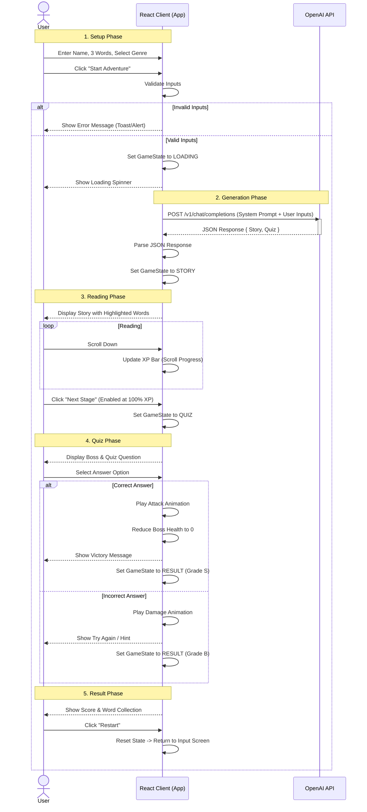

# Sequence Diagram: Word Master
**Project:** Word Master: My Own Novel Dungeon
**Version:** 1.0
**Date:** 2025-11-20

This document visualizes the interaction flow between the User, the React Client Application, and the OpenAI API.

## Main Game Flow

